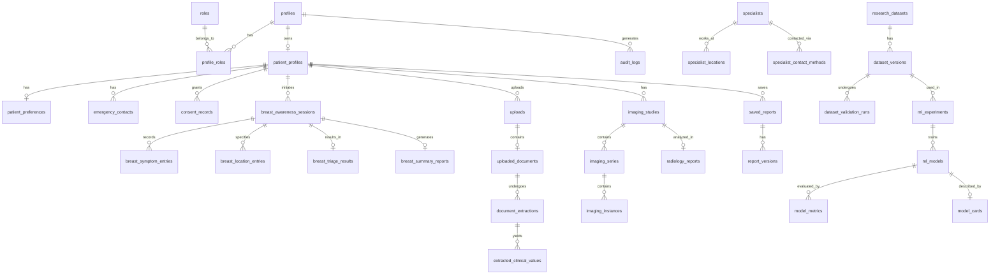

# Diagnex Database Architecture

## Entity Relationship Diagram

```mermaid
erDiagram
    profiles ||--o{ profile_roles : has
    roles ||--o{ profile_roles : belongs_to
    profiles ||--o| patient_profiles : owns
    profiles ||--o{ audit_logs : generates
    
    patient_profiles ||--o| patient_preferences : has
    patient_profiles ||--o{ emergency_contacts : has
    patient_profiles ||--o{ consent_records : grants
    patient_profiles ||--o{ breast_awareness_sessions : initiates
    patient_profiles ||--o{ uploads : uploads
    patient_profiles ||--o{ imaging_studies : has
    patient_profiles ||--o{ saved_reports : saves
    
    breast_awareness_sessions ||--o{ breast_symptom_entries : records
    breast_awareness_sessions ||--o{ breast_location_entries : specifies
    breast_awareness_sessions ||--o| breast_triage_results : results_in
    breast_awareness_sessions ||--o| breast_summary_reports : generates
    
    uploads ||--o| uploaded_documents : contains
    uploaded_documents ||--o{ document_extractions : undergoes
    document_extractions ||--o{ extracted_clinical_values : yields
    
    imaging_studies ||--o{ imaging_series : contains
    imaging_series ||--o{ imaging_instances : contains
    imaging_studies ||--o| radiology_reports : analyzed_in
    
    saved_reports ||--o{ report_versions : has
    
    specialists ||--o{ specialist_locations : works_at
    specialists ||--o{ specialist_contact_methods : contacted_via
    
    research_datasets ||--o{ dataset_versions : has
    dataset_versions ||--o{ dataset_validation_runs : undergoes
    dataset_versions ||--o{ ml_experiments : used_in
    ml_experiments ||--o{ ml_models : trains
    ml_models ||--o{ model_metrics : evaluated_by
    ml_models ||--o| model_cards : described_by
```
