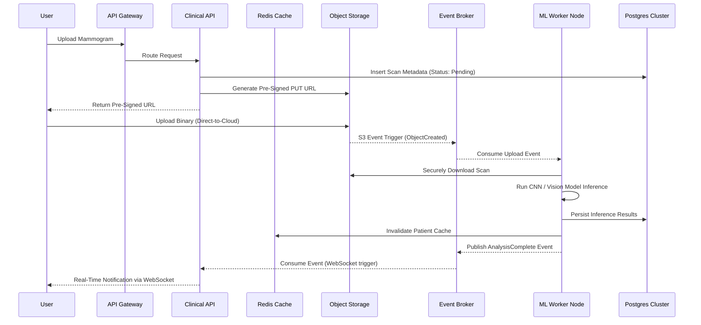

# Enterprise-Grade System Architecture Design

As a Senior Architecture Designer, I have engineered the complete system architecture for the Diagnex Breast Cancer Platform. This design employs a cloud-native, event-driven microservices pattern ensuring infinite horizontal scalability, strict zero-trust security (HIPAA compliance), and enterprise-grade observability.

## 1. High-Level Enterprise Architecture Overview

Diagnex abstracts monolithic complexities by decoupling services into domain-driven microservices. The system uses an API Gateway for ingress, an Event Bus for asynchronous choreography, and a distributed data layer.

> [!TIP]
> **Scalability & High Availability (HA) Strategy**
> All stateless services (Frontend, API, Workers) are containerized (Docker/Kubernetes) to allow auto-scaling. The data layer utilizes active-passive clustering with connection pooling (PgBouncer) and read-replicas for intense analytical workloads.

```mermaid
graph TD
    Client[Client (Web / Mobile / Clinic)]
    CDN[Cloudflare CDN & WAF]
    Gateway[API Gateway & Load Balancer\nNginx / Kong]
    
    subgraph "Frontend Layer (Edge)"
        NextJS[Next.js SSR Cluster\nReact, TS, Tailwind]
    end

    subgraph "Core Microservices (Service Mesh)"
        AuthAPI[Identity & Auth Service\nOAuth2 / JWT]
        CoreAPI[Clinical Core API\nFastAPI, SQLAlchemy]
        MLAPI[Inference API\nTriton / FastAPI]
    end

    subgraph "Event-Driven Processing Layer"
        EventBus[Message Broker / Event Bus\nRabbitMQ / Kafka]
        CeleryWorker[Distributed ML Workers\nCelery / GPU Nodes]
    end

    subgraph "Distributed Data Storage Layer"
        PgBouncer[PgBouncer Connection Pool]
        PostgresPrimary[(PostgreSQL Primary\nWrite-Heavy)]
        PostgresReplica[(PostgreSQL Replica\nRead/Analytics)]
        RedisCache[(Redis Cluster\nCaching & State)]
        S3[(Object Storage\nS3 AES-256 Encrypted)]
    end
    
    subgraph "Observability & Security"
        Telemetry[Prometheus & Grafana\nAPM & Logging]
        Vault[HashiCorp Vault\nKMS & Secrets]
    end

    Client -->|HTTPS| CDN
    CDN -->|DDoS Protection| Gateway
    Gateway -->|Static/SSR| NextJS
    Gateway -->|REST/GraphQL| AuthAPI
    Gateway -->|REST/GraphQL| CoreAPI
    
    CoreAPI -->|Produce Event| EventBus
    EventBus -->|Consume Event| CeleryWorker
    
    CoreAPI --> PgBouncer
    PgBouncer --> PostgresPrimary
    PostgresPrimary -.->|Streaming Replication| PostgresReplica
    
    CoreAPI --> S3
    CeleryWorker --> S3
    CoreAPI --> RedisCache
    
    CoreAPI -.-> Telemetry
    CeleryWorker -.-> Telemetry
```

## 2. Component Breakdown (Enterprise Tier)

### 2.1. Edge & Ingress Layer
- **CDN & WAF**: Cloudflare handles DDoS mitigation, Web Application Firewall (WAF) rules, and caches static assets globally at the edge.
- **API Gateway**: Nginx/Kong acts as a reverse proxy, handling SSL termination, rate limiting, and request routing.

### 2.2. Frontend (Next.js App Router)
- **Framework**: Next.js 14+ deployed on Vercel or a Node.js Kubernetes cluster.
- **Architecture**: Employs React Server Components (RSC) to minimize client bundle size and execute data fetching securely on the server.
- **State & UI**: Zustand for atomic state management; Framer Motion for hardware-accelerated animations.

### 2.3. Microservices Backend (FastAPI)
- **Framework**: FastAPI (Python) utilizing ASGI for high-concurrency async I/O.
- **Domain-Driven Design (DDD)**: Separated into logical domains (`auth`, `clinical_records`, `imaging_pipeline`).
- **ORM & Migrations**: SQLAlchemy 2.0 with Alembic.

### 2.4. Event-Driven Background Processing
- **Event Bus**: RabbitMQ or Apache Kafka handles asynchronous choreography.
- **Task Orchestration**: Celery workers consume events (e.g., `ImageUploadedEvent`) to trigger ML inference without blocking API threads.
- **Hardware Acceleration**: ML Workers can be deployed on GPU-enabled nodes dynamically based on queue depth.

### 2.5. Storage & Caching Layer
- **Database**: PostgreSQL 16. Uses PgBouncer to prevent connection exhaustion. Read-replicas handle heavy BI/analytics queries.
- **Caching**: Redis Cluster caches frequent queries (e.g., specialist directories, static metadata) to achieve sub-10ms response times.
- **Object Storage**: S3-compatible blob storage with AES-256 encryption at rest, utilizing pre-signed URLs to offload binary transfer from the API servers.

## 3. Advanced Data Flow: Asynchronous ML Orchestration



## 4. Security, Compliance, and DevOps

> [!CAUTION]
> **HIPAA & SOC2 Compliance Architecture**
> Diagnex treats security as a fundamental layer, not an afterthought.

1. **Zero-Trust Security**: Network policies restrict inter-pod communication. The DB is only accessible from the API tier.
2. **Encryption**: 
   - **In Transit**: TLS 1.3 everywhere.
   - **At Rest**: PostgreSQL data and S3 buckets are encrypted using keys managed by HashiCorp Vault.
3. **Observability (APM)**: OpenTelemetry instruments all traces. Logs are aggregated in an ELK Stack (Elasticsearch, Logstash, Kibana) or Grafana Loki.
4. **CI/CD Pipeline**: GitHub Actions automates unit testing, SonarQube static code analysis, Docker image builds, and ArgoCD manages GitOps deployments to Kubernetes.
